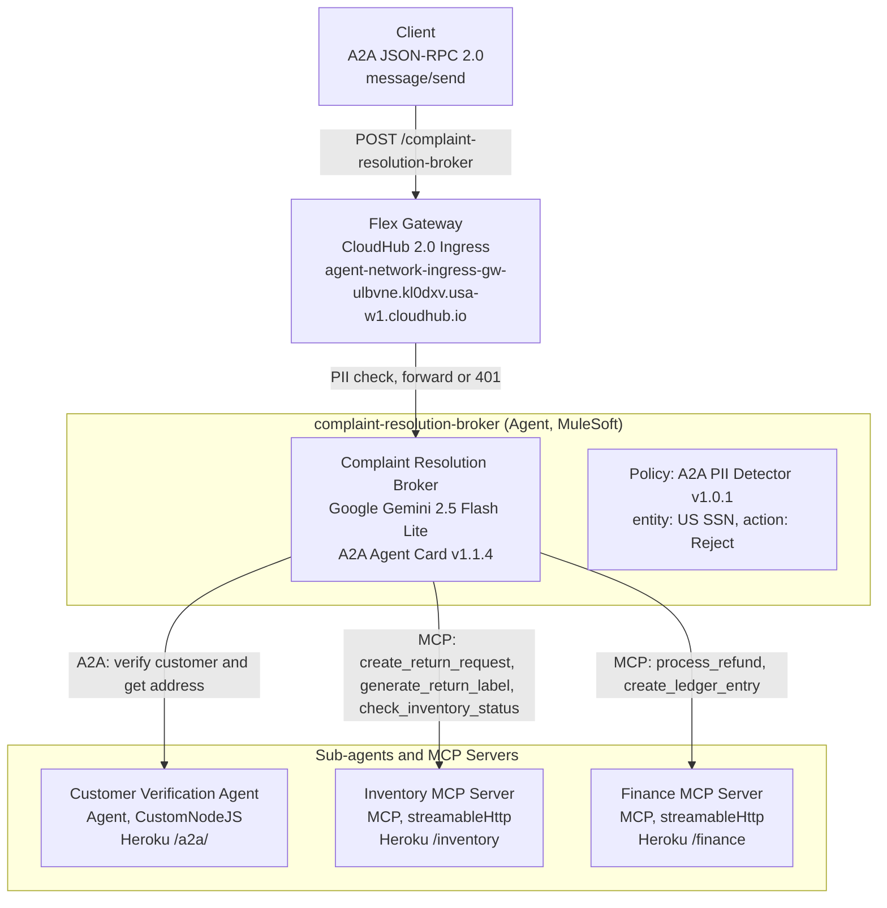
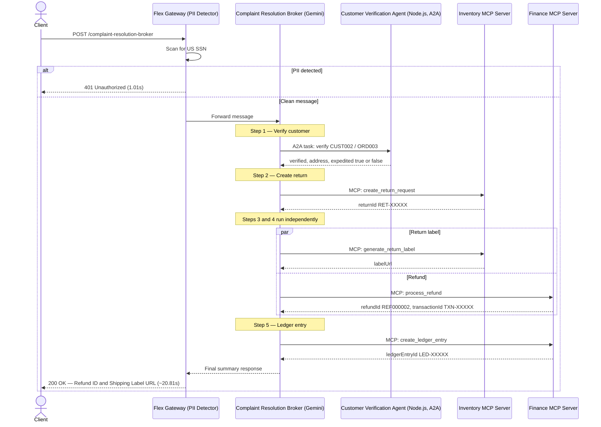
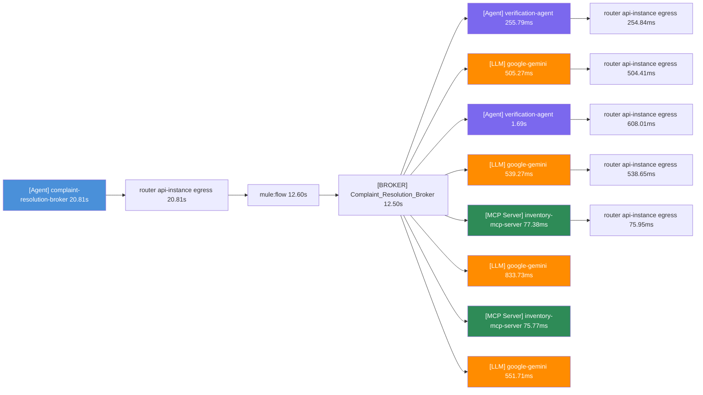
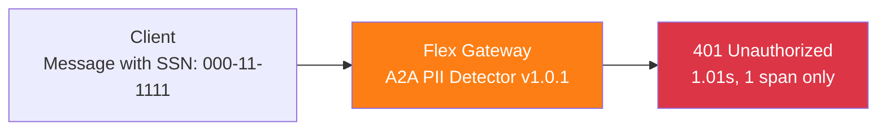
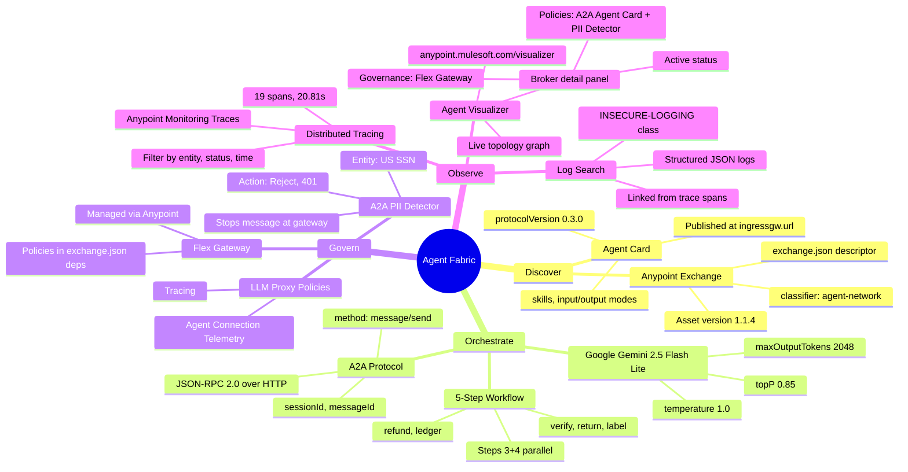

# Architecture Diagrams — Customer Complaint Resolution Network

Diagrams use [Mermaid](https://mermaid.js.org/) notation.
Render in GitHub, VS Code (Mermaid Preview extension), or [mermaid.live](https://mermaid.live).

All diagrams are derived from the actual deployed system at TDX 2026.
Agent Visualizer topology confirmed at anypoint.mulesoft.com/visualizer/agentvisualizer/


## 1. Deployed Agent Network Topology

As seen in Anypoint Agent Visualizer (Exercise 5):




## 2. 5-Step Orchestration Sequence




## 3. Trace Span Hierarchy (from Anypoint Monitoring)

Actual trace from Exercise 5 — Trace ID ddecffb6c76a554cee11cc53da7b35bc, 22 Apr 2026 12:42 am, 20.81s total, 19 spans:



Span types: [Agent] = A2A agent call, [LLM] = Gemini reasoning step, [MCP Server] = MCP tool invocation, router api-instance egress = Flex Gateway routing span.


## 4. PII Rejection Trace (Exercise 4 result)

When a message contains a US SSN, the policy fires at ingress:



Trace shows exactly 1 span ([Agent] complaint-resolution-broker, 1.01s).
The LLM is never called. No MCP tools are invoked. The SSN never leaves the gateway.


## 5. MuleSoft Agent Fabric — Four Pillars




## 6. Project File Structure

```
customer-complaint-resolution/
├── agent-network.yaml          agent network spec (schemaVersion 1.0.0)
├── exchange.json               Anypoint Exchange descriptor (no secrets)
├── .env.example                environment variable template
├── .gitignore                  prevents secret leakage
├── policies/
│   ├── pii-policy.yaml         A2A PII Detector config reference
│   └── llm-proxy-policies.yaml LLM proxy policy reference
└── diagrams/
    └── architecture.md         this file
```
